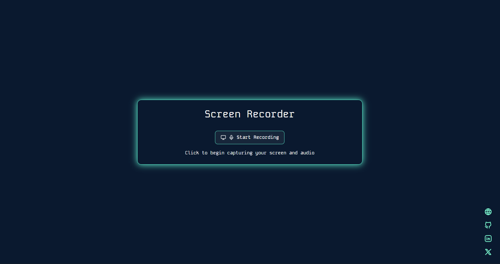
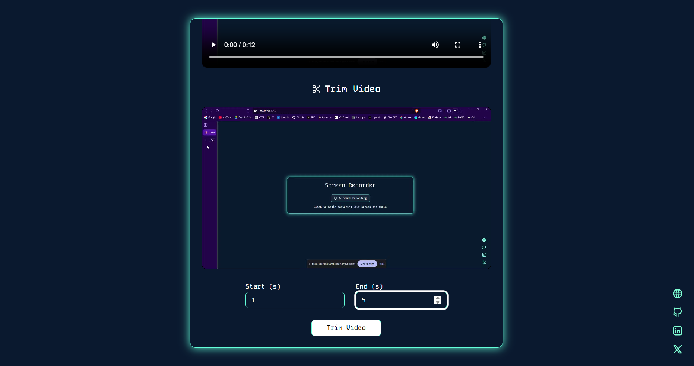
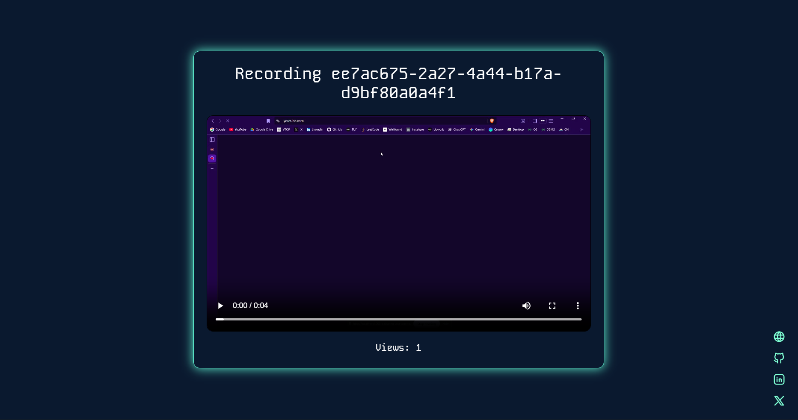

# 🎬 MarvEdge - Screen Recording MVP

A modern Next.js application for browser-based screen recording with intelligent trimming, seamless uploading, and easy sharing capabilities.

**🌐 [Live Demo](https://marv-edge.vercel.app/)**

## ✨ Features

- 🎥 **Screen Recording** - Capture screen + microphone using MediaRecorder API
- ✂️ **Video Trimming** - Edit video start and end times with ffmpeg.wasm
- 📤 **Cloud Upload** - Upload trimmed videos to UploadThing
- 🔗 **Share Links** - Generate public share links for instant sharing
- 📊 **Analytics** - Track video view counts
- 🎨 **Beautiful UI** - Modern interface with Tailwind CSS
- 🚀 **Deployment Ready** - Optimized for Vercel deployment

## 📖 Usage

1. 🎙️ Click **"Start Recording"** to begin screen recording with microphone
2. ⏹️ Click **"Stop Recording"** when finished capturing
3. ✏️ Adjust trim start/end times and click **"Trim and Export"**
4. 📤 The video will be uploaded to the cloud and a shareable link will be provided
5. 🌍 Share the link with others to view the video publicly

## 📸 Screenshots

### Landing Page

### Video Trimming Interface

### Shareable Video Link

## 🛠️ Tech Stack

- **Frontend**: Next.js 16, React 19, TypeScript
- **Styling**: Tailwind CSS 4
- **Video Processing**: ffmpeg.wasm for in-browser video trimming
- **Storage**: UploadThing for cloud file storage
- **Database**: Vercel KV for Redis-based data persistence
- **UI Components**: Radix UI, Lucide Icons, Tabler Icons
- **Deployment**: Vercel with KV storage

## 🌐 Connect With Me

- 🌟 **Portfolio**: [https://samp231004.github.io/Portfolio/](https://samp231004.github.io/Portfolio/)
- 💻 **GitHub**: [https://github.com/SamP231004](https://github.com/SamP231004)
- 💼 **LinkedIn**: [https://www.linkedin.com/in/samp2310](https://www.linkedin.com/in/samp2310)
- 𝕏 **X (Twitter)**: [https://x.com/Sam231004](https://x.com/Sam231004)